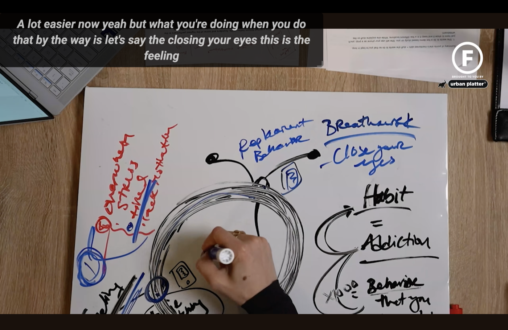

# Free Live Captions

A browser extension that captions any tab's audio in real time — YouTube, web-based Zoom/Meet/Teams calls, local lecture recordings — entirely on-device, entirely free, with no account and no cloud dependency.



## Quick start

```sh
git clone https://github.com/Ritika434/free-live-captions.git
cd free-live-captions/extension
npm install
npm run build
```

Then in Chrome or Edge:

1. Go to `chrome://extensions`
2. Enable **Developer mode** (top right)
3. Click **Load unpacked** and select the `extension/dist` folder
4. Open any tab with audio (a YouTube video is the easiest first test), click the extension's toolbar icon, and hit **Turn captions on**

First run downloads the speech model (tens of MB) from Hugging Face and caches it — every session after that works fully offline. See [`extension/README.md`](./extension/README.md) for the full manual test checklist, local-file captioning setup, and known limitations.

## Why

Real-time captioning is an accessibility accommodation, not a premium feature. Existing tools gate this behind free-minute caps or monthly subscriptions because they route audio through paid cloud ASR APIs. This project instead runs open-weight speech models (Whisper / Moonshine, both MIT-licensed) locally in the browser via WebGPU/WASM — no per-minute cost to pass on, so there's nothing to charge for.

See [constitution.md](./constitution.md) for the non-negotiable principles this project is held to (free forever, privacy by default, local-first, accessible by design).

## Status

**Live-tested and working.** P0 (Phases 0–6) is implemented, running, and has been iterated on against real tab audio (YouTube, streaming video) — not just built-and-hoped. Several real bugs surfaced through that testing and are fixed; the full honest log (what broke, why, and how it was fixed) lives in [`tasks.md`](./specs/001-live-captioning-p0/tasks.md). Code lives in [`extension/`](./extension/) — see [`extension/README.md`](./extension/README.md) for the full build/install/manual-test details.

- [`specs/001-live-captioning-p0/spec.md`](./specs/001-live-captioning-p0/spec.md) — what P0 must do and why, with testable acceptance criteria
- [`specs/001-live-captioning-p0/design.md`](./specs/001-live-captioning-p0/design.md) — technical architecture (Manifest V3, offscreen document, Transformers.js pipeline, messaging contract)
- [`specs/001-live-captioning-p0/tasks.md`](./specs/001-live-captioning-p0/tasks.md) — phased implementation checklist + the bug/decision log from real-world testing

## P0 at a glance

- Caption any tab's audio, including local `file://` video playback, via `chrome.tabCapture` + an offscreen document (MV3's audio-capable context).
- Transcription runs fully on-device via Transformers.js — Moonshine (`onnx-community/moonshine-{tiny,base}-ONNX`) is the default engine, switched to after real-world testing showed the initial Whisper-tiny/base default wasn't accurate enough. Encoder weights are explicitly pinned to fp32 (decoder to q4) since encoder quantization measurably degrades accuracy — this alone produced a noticeable, user-confirmed accuracy improvement. WebGPU-accelerated with automatic WASM fallback.
- Styled, draggable, fullscreen-aware caption overlay rendered in a Shadow DOM so it can't be broken by host-page CSS — tuned through real testing to avoid stale/blended text and screen overflow on continuous dialogue (see tasks.md bug log #4, #8).
- User-selectable model tier (tiny/base/small) with honest accuracy/speed tradeoff labels — hardware-based auto-recommendation is designed but not yet implemented (every install currently defaults to "base").
- Session transcript export to `.txt` / `.srt` — closing the "captions vanish forever" gap in Chrome's built-in Live Caption.
- No account, no telemetry (confirmed by grep, not just by design), no paid tier. The extension's own UI is built with accessible, semantic markup targeting WCAG 2.1 AA — not yet audited with axe-core/Lighthouse.

## Next step

What's left is tracked honestly in [`tasks.md`](./specs/001-live-captioning-p0/tasks.md) — mainly hardware-aware model-tier defaults (every install currently defaults to "base" regardless of the machine), a formal WER/latency benchmark to replace the current real-use judgment calls, and an accessibility audit (axe-core/Lighthouse) of the popup UI.
